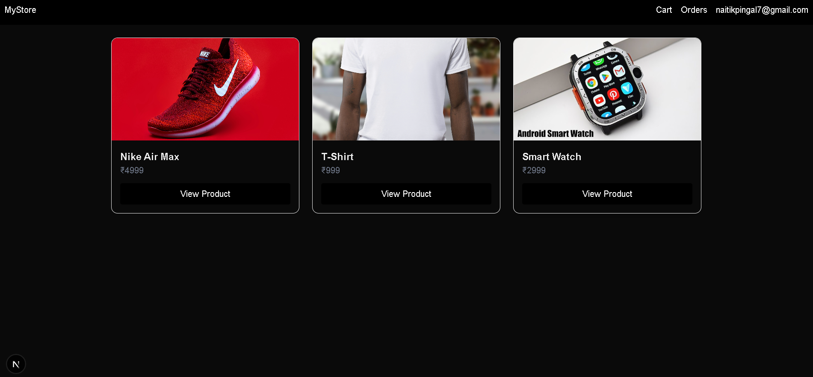
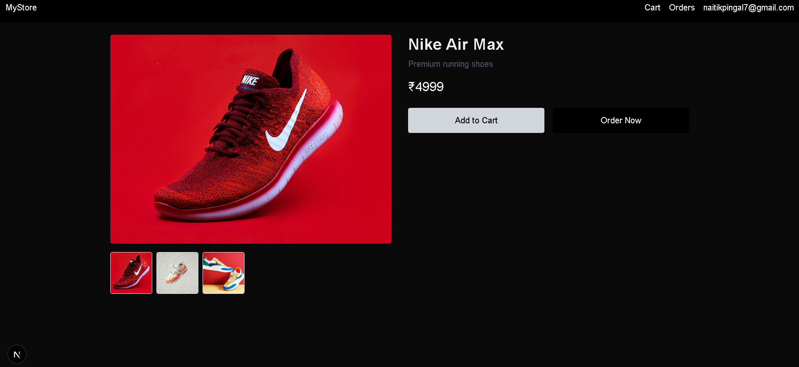
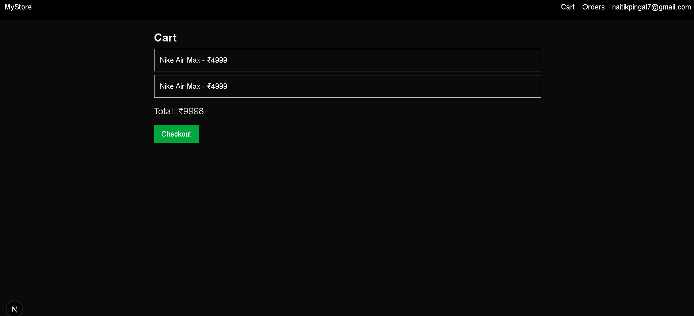

# 🛒 MyStore – Modern E-Commerce Web App

A responsive and clean e-commerce web application built using **Next.js**, **TypeScript**, and **Tailwind CSS**.
This project demonstrates a complete shopping experience including product browsing, image gallery, cart system, and basic login functionality.

---

## 🚀 Features

* 🏬 Product listing (grid layout)
* 🔍 Product detail page with **image gallery**
* 🛍 Add to Cart functionality (localStorage)
* ⚡ “Order Now” quick checkout flow
* 👤 Basic login system (localStorage-based)
* 📦 Orders page (UI)
* 📱 Fully responsive design

---

## 🖼 Screenshots

### 🏠 Homepage



### 📄 Product Page



### 🛒 Cart Page



---

## 🛠 Tech Stack

* **Framework:** Next.js (App Router)
* **Language:** TypeScript
* **Styling:** Tailwind CSS
* **State Management:** React Hooks
* **Storage:** LocalStorage

---

## 📂 Project Structure

```
app/
  product/[id]/
  cart/
  login/
  orders/

components/
  Navbar.tsx
  ProductCard.tsx

lib/
  products.ts
  cart.ts
```

---

## ⚙️ Getting Started

Clone the repository:

```
git clone https://github.com/OP0710/my-store.git
cd my-store
```

Install dependencies:

```
npm install
```

Run the development server:

```
npm run dev
```

Open in browser:

```
http://localhost:3000
```

---

## 🧠 Key Learnings

* Dynamic routing using Next.js App Router
* Component-based architecture
* Managing state using React hooks
* Handling client-side storage (localStorage)
* Structuring scalable frontend projects

---

## ⚠️ Limitations

* No backend/database integration
* Authentication is not secure (demo only)
* No payment gateway integration

---

## 🔮 Future Improvements

* Backend integration (Supabase / Firebase)
* Secure authentication system
* Stripe payment integration
* Order history with database
* Admin dashboard

---

## 👨‍💻 Author

**Naitik Pingal**
Frontend Developer (Learning & Building)

---

## ⭐ Support

If you like this project, consider giving it a ⭐ on GitHub!
